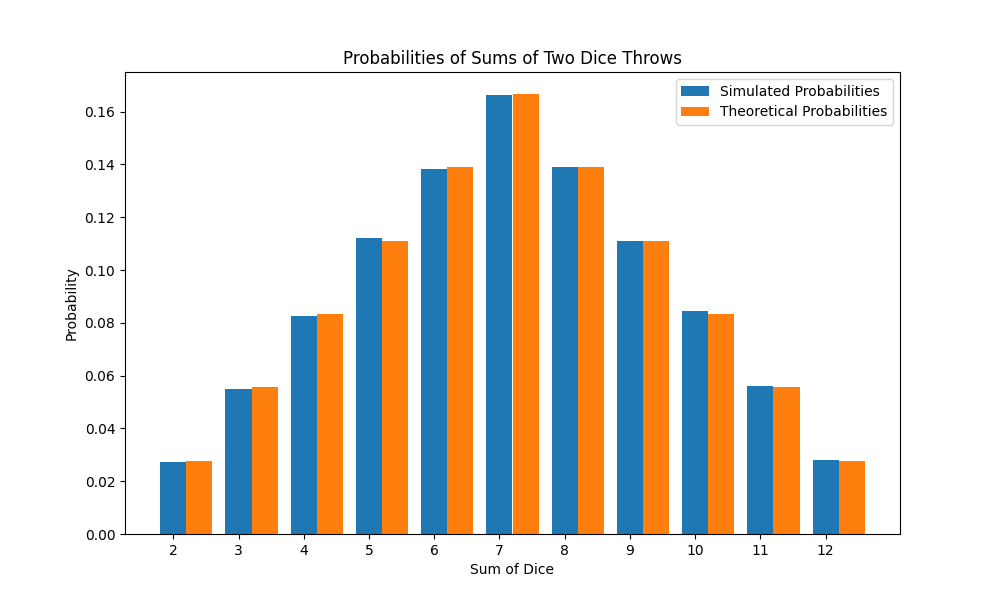

# Моделювання Монте-Карло для сум двох кубиків

Цей проект моделює кидання двох кубиків велику кількість разів і обчислює ймовірності кожної можливої суми за допомогою методу Монте-Карло. Результати потім порівнюються з теоретичними ймовірностями.

## Змодельовані та теоретичні ймовірності

| Сума | Змодельована ймовірність | Теоретична ймовірність |
|------|---------------------------|------------------------|
|   10 |              8.4500% |                   8.3333% |
|   11 |              5.5980% |                   5.5556% |
|   12 |              2.7870% |                   2.7778% |
|    2 |              2.7160% |                   2.7778% |
|    3 |              5.4960% |                   5.5556% |
|    4 |              8.2540% |                   8.3333% |
|    5 |             11.2220% |                  11.1111% |
|    6 |             13.8370% |                  13.8889% |
|    7 |             16.6130% |                  16.6667% |
|    8 |             13.9200% |                  13.8889% |
|    9 |             11.1070% |                  11.1111% |

## Висновок

Змодельовані ймовірності близько відповідають теоретичним ймовірностям, що демонструє точність методу Монте-Карло для цієї задачі. Незначні відмінності обумовлені випадковістю та кількістю виконаних симуляцій.

## Графік ймовірностей

Нижче наведено графік, що порівнює змодельовані та теоретичні ймовірності сум чисел на двох кубиках:

